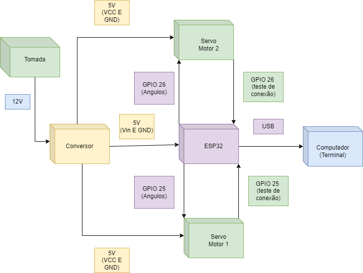

# projeto-embarcados-parte_2
| Supported Targets | ESP32 | ESP32-C2 | ESP32-C3 | ESP32-C6 | ESP32-H2 | ESP32-P4 | ESP32-S2 | ESP32-S3 |
| ----------------- | ----- | -------- | -------- | -------- | -------- | -------- | -------- | -------- |

# Controle de Servos para ESP32

Este projeto demonstra como controlar servos usando o ESP32 e o driver LEDC (LED Controller) da ESP-IDF. Ele inclui a configuração e o controle de servos através de uma interface de alto nível e uma interface de hardware.


## Índice

1. [Visão Geral](#visão-geral)
2. [Instalação e Configuração](#instalação-e-configuração)
3. [Uso](#uso)
4. [Observações](#observações)
5. [APIs](#apis)

## Visão Geral

Este projeto fornece uma biblioteca para controlar servos motores usando o ESP32. A biblioteca oferece uma interface simples para inicializar servos, definir e obter ângulos, e desinicializar os servos. Utiliza o PWM (Pulse Width Modulation) para controlar a posição dos servos e é baseada no framework ESP-IDF.

## Instalação e Configuração

1. **Clone o Repositório**

   ```bash
   git clone https://github.com/seu-usuario/esp32-servo-control.git
   cd esp32-servo-control

## Estrutura do Projeto

- `servo_hw.h` / `servo_hw.c`: Implementação da interface de hardware para inicialização e controle dos servos.
- `servo_tools.h` / `servo_tools.c`: Interface de alto nível para configuração e controle dos servos.
- `main.c`: Exemplo de aplicação que configura e movimenta dois servos.

## Funcionalidades

- **Inicialização de Servos**: Configuração do GPIO e do canal LEDC para o servo.
- **Configuração do Ângulo**: Definição do ângulo do servo com base na largura do pulso.
- **Desinicialização do Servo**: Liberação do canal LEDC e parada do PWM para o servo.

## Requisitos

- [ESP-IDF](https://docs.espressif.com/projects/esp-idf/en/latest/esp32/) (framework de desenvolvimento para ESP32)
- [ESP32 Dev Kit](https://www.espressif.com/en/products/devkits)

## Instalação e Configuração

1. **Clone o Repositório**

   ```bash 
   git clone <[url-do-repositorio](https://github.com/GabrielAlbinoo/projeto-embarcados-parte_2.git)>
   cd <diretorio-do-repositorio>
    ```

2. **Configure o Ambiente ESP-IDF**

   Certifique-se de ter o ESP-IDF configurado corretamente.

   ```bash
   export IDF_PATH=/caminho/para/esp-idf
    ```

3. **Construa e Faça o Upload do Firmware**

   Crie e entre no diretório de construção:

   ```bash
   mkdir -p build
   cd build
    ```

   Configure o projeto:

   ```bash
   idf.py set-target esp32
   cd build
    ```
   Compile e faça o upload:

   ```bash
   idf.py build
   idf.py flash
    ```

4. **Monitore a Saída**

   ```bash
   idf.py monitor
    ```

### Diagrama de Blocos


### Esquemático do Hardware


### Máquina de Estados


## Uso

O exemplo `main.c` demonstra como configurar e controlar dois servos conectados aos pinos GPIO 25 e 26 do ESP32. O código movimenta os servos para um ângulo aleatório entre 0 e 180 graus a cada segundo.

### Passos para Usar o Projeto

1. **Inicialização dos Servos**: O código inicializa dois servos com as configurações padrão de ângulo e frequência de PWM. 

2. **Movimentação dos Servos**: A cada segundo, o código gera um ângulo aleatório entre 0 e 180 graus e ajusta a posição dos servos de acordo.

3. **Desinicialização**: Após o loop principal, o código desinicializa os servos e libera os recursos alocados.

### Exemplo de Código

O seguinte trecho de código ilustra como o exemplo `main.c` configura e movimenta os servos:

```c
#include "servo_tools.h"
#include "esp_log.h"
#include "stdlib.h"

void app_main(void)
{
    ServoConfig servo_1 = {
        .gpio_num = 25,
        .pwm_freq = 50,
        .min_angle = 0,
        .max_angle = 180
    };

    ServoConfig servo_2 = {
        .gpio_num = 26,
        .pwm_freq = 50,
        .min_angle = 0,
        .max_angle = 180
    };

    esp_err_t ret = servo_init(&servo_1);
    if (ret != ESP_OK)
    {
        printf("Falha ao inicializar o servo 1: %s", esp_err_to_name(ret));
        return;
    }

    ret = servo_init(&servo_2);
    if (ret != ESP_OK)
    {
        printf("Falha ao inicializar o servo 2: %s", esp_err_to_name(ret));
        return;
    }

    while (1)
    {
        ServoAngle angle_1 = rand() % 181;
        ret = servo_set_angle(&servo_1, angle_1);
        if (ret == ESP_OK)
        {
            printf("Servo 1 movido para %d graus.\n", angle_1);
        }
        else
        {
            printf("Falha ao definir o ângulo do servo 1: %s\n", esp_err_to_name(ret));
            break;
        }

        ServoAngle angle_2 = rand() % 181;
        ret = servo_set_angle(&servo_2, angle_2);
        if (ret == ESP_OK)
        {
            printf("Servo 2 movido para %d graus.\n", angle_2);
        }
        else
        {
            printf("Falha ao definir o ângulo do servo 2: %s\n", esp_err_to_name(ret));
            break;
        }

        vTaskDelay(pdMS_TO_TICKS(1000));
    }

    ret = hw_servo_deinit(servo_1.gpio_num);
    if (ret != ESP_OK)
    {
        printf("Falha ao desabilitar o servo 1: %s\n", esp_err_to_name(ret));
    }
    else
    {
        printf("Servo 1 desabilitado com sucesso.\n");
    }

    ret = hw_servo_deinit(servo_2.gpio_num);
    if (ret != ESP_OK)
    {
        printf("Falha ao desabilitar o servo 2: %s\n", esp_err_to_name(ret));
    }
    else
    {
        printf("Servo 2 desabilitado com sucesso.\n");
    }
}

 ```

### Observações

- **Ângulos e Largura do Pulso**: O código assume que os servos estão configurados para aceitar uma largura de pulso entre 500 µs e 2500 µs, correspondendo a ângulos entre 0 e 180 graus. Certifique-se de ajustar esses valores de acordo com as especificações dos seus servos.

- **Delay**: Um atraso de 1 segundo (`vTaskDelay(pdMS_TO_TICKS(1000))`) é usado entre os movimentos dos servos para garantir que eles tenham tempo suficiente para se mover até a nova posição antes de atualizar novamente. Esse intervalo pode ser ajustado conforme necessário para seu aplicativo específico.

- **Configuração do PWM**: O projeto utiliza a frequência PWM de 50 Hz, que é comum para servos padrão. Se estiver usando servos que requerem uma frequência diferente, você precisará ajustar a configuração do timer LEDC no código.

- **Inicialização e Desinicialização**: O código inclui funções para inicializar (`servo_init`) e desinicializar (`hw_servo_deinit`) os servos. Certifique-se de sempre desinicializar os servos quando eles não forem mais necessários para liberar os recursos alocados.

- **Tratamento de Erros**: O código realiza verificações de erro em cada operação crítica. Certifique-se de que a comunicação com o hardware está funcionando corretamente e que não há falhas no hardware.

## APIs

### `hw_servo_init(uint8_t gpio_num)`

Inicializa o servo no GPIO especificado.

**Parâmetros:**

- `gpio_num`: O número do GPIO onde o servo está conectado.

**Retorno:**

- `esp_err_t`: Código de erro. `ESP_OK` em caso de sucesso.

### `hw_servo_set_pulse_width(uint8_t gpio_num, uint32_t pulse_width_us)`

Define a largura do pulso PWM para o servo.

**Parâmetros:**

- `gpio_num`: O número do GPIO onde o servo está conectado.
- `pulse_width_us`: Largura do pulso em microssegundos (500 a 2500 µs).

**Retorno:**

- `esp_err_t`: Código de erro. `ESP_OK` em caso de sucesso.

### `hw_servo_deinit(uint8_t gpio_num)`

Desinicializa o servo e libera o canal LEDC.

**Parâmetros:**

- `gpio_num`: O número do GPIO onde o servo está conectado.

**Retorno:**

- `esp_err_t`: Código de erro. `ESP_OK` em caso de sucesso.

### `servo_init(ServoConfig *config)`

Inicializa o servo com a configuração fornecida.

**Parâmetros:**

- `config`: Estrutura contendo a configuração do servo, incluindo número do GPIO, frequência PWM, e ângulos mínimo e máximo.

**Retorno:**

- `esp_err_t`: Código de erro. `ESP_OK` em caso de sucesso.

### `servo_set_angle(ServoConfig *config, ServoAngle angle)`

Define o ângulo do servo.

**Parâmetros:**

- `config`: Estrutura contendo a configuração do servo.
- `angle`: Ângulo a ser definido (entre `min_angle` e `max_angle`).

**Retorno:**

- `esp_err_t`: Código de erro. `ESP_OK` em caso de sucesso.

### `servo_get_angle(const ServoConfig *config, ServoAngle *angle)`

Obtém o ângulo atual do servo. (Nota: A funcionalidade de obtenção de ângulo ainda não foi implementada.)

**Parâmetros:**

- `config`: Estrutura contendo a configuração do servo.
- `angle`: Ponteiro para a variável onde o ângulo será armazenado.

**Retorno:**

- `esp_err_t`: Código de erro. `ESP_OK` em caso de sucesso.

<hr>

#### Equipe:

- Álisson Leandro de Souza Silva;

- Amanda Ferreira da Silva Alves;
  
- Ana Carolina Dutra Ramos;
  
- Gabriel Albino de Oliveira;
  
- Pâmella Vitória Gomes Farias;
  
- Sara Aymê Marinho Gaspar.

#### Professor: 

- Alexandre Sales Vasconcelos.

#### Disciplina: 

- Sistemas Embarcados.
