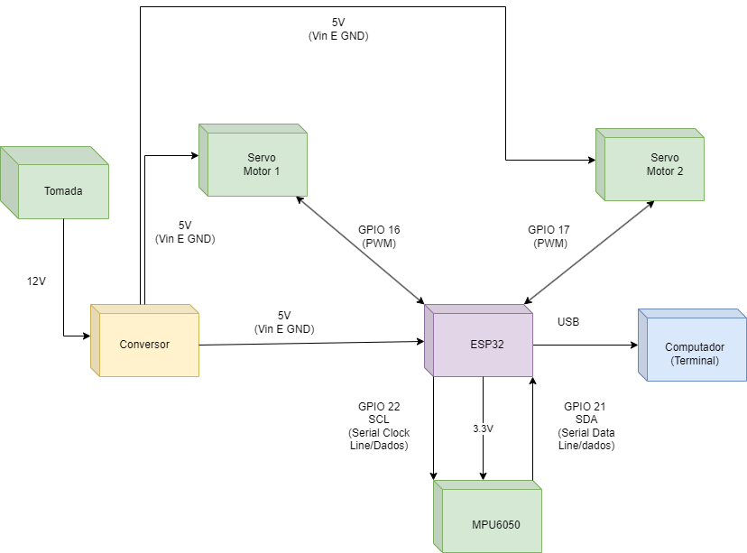

# projeto-embarcados-parte_3

| Supported Targets | ESP32 | ESP32-C2 | ESP32-C3 | ESP32-C6 | ESP32-H2 | ESP32-P4 | ESP32-S2 | ESP32-S3 |
| ----------------- | ----- | -------- | -------- | -------- | -------- | -------- | -------- | -------- |

# Projeto de Controle de Servos com IMU para ESP32

Este projeto utiliza um sensor IMU (Inertial Measurement Unit) para controlar dois servos. Os ângulos de Euler obtidos do sensor são convertidos e usados para definir as posições dos servos.

## Índice

- [Visão Geral](#visão-geral)
- [Estrutura do Código](#estrutura-do-código)
- [Funcionalidades do Projeto](#funcionalidades-do-projeto)
- [Dependências](#dependências)
- [Instalação](#instalação)
- [Uso](#uso)
- [APIs Utilizadas](#apis-utilizadas)

## Visão Geral

Este projeto foi desenvolvido para controlar dois servos utilizando dados de um sensor IMU. O código lê os dados de aceleração e giroscópio, calcula o quaternion e os ângulos de Euler, e mapeia esses ângulos para o intervalo de movimento dos servos.

## Estrutura do Código

O código principal é composto por:

- **Função `map_angle(float angle)`**: Converte um ângulo em radianos para o intervalo de 0 a 180 graus.
- **Função `app_main(void)`**: Função principal que inicializa os servos, lê os dados do sensor IMU e controla os servos com base nos ângulos de Euler.

## Funcionalidades do Projeto

1. **Leitura de Dados do Sensor IMU**:
   - Captura dados de aceleração (em m/s²) e giroscópio (em rad/s) em tempo real.

2. **Cálculo de Quaternion**:
   - Converte os dados do sensor IMU em um quaternion, que representa a orientação do sensor.

3. **Cálculo de Ângulos de Euler**:
   - Deriva os ângulos de Euler (Roll, Pitch e Yaw) a partir do quaternion para facilitar a interpretação da orientação.

4. **Mapeamento de Ângulos**:
   - Mapeia os ângulos de Euler (Roll e Pitch) para um intervalo adequado (0 a 180 graus) para controle dos servos.

5. **Controle de Servos**:
   - Ajusta a posição de dois servos em tempo real com base nos ângulos de Euler, permitindo uma resposta dinâmica aos movimentos detectados.

6. **Saída de Monitoramento**:
   - Exibe dados no terminal, incluindo aceleração, giroscópio, quaternion e ângulos de Euler, para fácil acompanhamento do estado do sistema.

7. **Tratamento de Erros**:
   - Implementa verificação de erros ao inicializar os servos e ao ler os dados do sensor, garantindo robustez no funcionamento.

## Dependências

Este projeto depende das seguintes bibliotecas:

- [ESP-IDF](https://docs.espressif.com/projects/esp-idf/en/latest/esp32/index.html) - Framework para desenvolvimento com ESP32.
- Driver I2C - Para comunicação com o sensor IMU.

## Instalação

Para compilar e executar este projeto, siga os passos abaixo:

1. Clone o repositório:
   ```bash
   git clone <[url-do-repositorio](https://github.com/GabrielAlbinoo/projeto-embarcados-parte_3.git)>
   cd <diretorio-do-repositorio>
    ```
2. Instale as dependências necessárias conforme as instruções da [documentação do ESP-IDF](https://docs.espressif.com/projects/esp-idf/en/latest/esp32/get-started/index.html).

3. **Configure o Ambiente ESP-IDF**

   Certifique-se de ter o ESP-IDF configurado corretamente.

   ```bash
   export IDF_PATH=/caminho/para/esp-idf
    ```

5. Construa o projeto:
   ```bash
   mkdir -p build
   cd build
    ```
6. Construa e Faça o Upload do Firmware:
   Configure o projeto:

   ```bash
   idf.py set-target esp32
   cd build
    ```
   Compile e faça o upload:

   ```bash
   idf.py build
   idf.py flash
    ```
7. Abra o terminal serial para monitorar a saída:
   ```bash
   idf.py monitor
    ```

### Diagrama de Blocos


### Esquemático do Hardware


### Máquina de Estados


## Uso
Após a inicialização do sistema, os servos se moverão de acordo com os ângulos de Euler medidos pelo IMU. Certifique-se de que o sensor está corretamente conectado e configurado.

### Passos para Usar o Projeto

Após carregar o firmware no dispositivo ESP32, siga os passos abaixo para utilizar o projeto:

1. **Conexões**: Certifique-se de que o sensor IMU e os servos estão corretamente conectados aos pinos GPIO especificados no código (GPIO 16 e 17 para os servos). Consulte a documentação do seu sensor IMU para as conexões corretas.

2. **Inicialização**: Quando o sistema for ligado, o código inicializará automaticamente os servos e o sensor IMU. O terminal exibirá mensagens informando o status da inicialização.

3. **Leitura de Dados**: O programa começará a ler os dados do sensor IMU continuamente. A cada ciclo, ele calculará os valores de aceleração e giroscópio, além de converter esses dados em um quaternion e, em seguida, em ângulos de Euler.

4. **Movimento dos Servos**: Os ângulos de Euler obtidos (Roll e Pitch) serão mapeados para valores entre 0 e 180 graus. Os servos se moverão conforme os ângulos de Euler, permitindo uma resposta dinâmica aos movimentos detectados pelo sensor.

5. **Monitoramento**: Você poderá visualizar a saída no terminal, que mostrará:
   - Valores de aceleração (em m/s²)
   - Valores de giroscópio (em rad/s)
   - Valores do quaternion
   - Ângulos de Euler (Roll, Pitch, Yaw)
   - Posições dos servos em graus

6. **Interrupção do Programa**: Para interromper a execução do programa, você pode usar o comando de interrupção no terminal (geralmente Ctrl + C).

Certifique-se de que o ambiente está seguro e que os servos não estão obstruídos durante o movimento. Isso garantirá que o sistema funcione corretamente e evite danos ao hardware.

## APIs Utilizadas

Este projeto utiliza várias APIs para interagir com o sensor IMU e controlar os servos. Abaixo estão as principais APIs e suas descrições.

### API do Sensor IMU

- **`imu_read_data(IMUData* data)`**
  - **Descrição**: Lê os dados do sensor IMU e os armazena na estrutura `IMUData`.
  - **Parâmetros**: 
    - `data`: Ponteiro para a estrutura onde os dados serão armazenados.
  - **Retorno**: `ESP_OK` em caso de sucesso, ou um código de erro em caso de falha.

- **`imu_calculate_quaternion(const IMUData* data, Quaternion* quat)`**
  - **Descrição**: Calcula o quaternion a partir dos dados do sensor IMU.
  - **Parâmetros**: 
    - `data`: Ponteiro para a estrutura `IMUData` com os dados do sensor.
    - `quat`: Ponteiro para a estrutura onde o quaternion resultante será armazenado.
  - **Retorno**: `ESP_OK` em caso de sucesso, ou um código de erro em caso de falha.

- **`imu_calculate_euler_angles(const Quaternion* quat, EulerAngle* angles)`**
  - **Descrição**: Converte um quaternion em ângulos de Euler.
  - **Parâmetros**: 
    - `quat`: Ponteiro para a estrutura `Quaternion` contendo os dados do quaternion.
    - `angles`: Ponteiro para a estrutura onde os ângulos de Euler resultantes serão armazenados.
  - **Retorno**: `ESP_OK` em caso de sucesso, ou um código de erro em caso de falha.

### API de Controle de Servos

- **`servo_init(ServoConfig* config)`**
  - **Descrição**: Inicializa um servo com a configuração especificada.
  - **Parâmetros**: 
    - `config`: Ponteiro para a estrutura `ServoConfig` que contém a configuração do servo.
  - **Retorno**: `ESP_OK` em caso de sucesso, ou um código de erro em caso de falha.

- **`servo_set_angle(ServoConfig* config, ServoAngle angle)`**
  - **Descrição**: Define o ângulo de um servo.
  - **Parâmetros**: 
    - `config`: Ponteiro para a estrutura `ServoConfig` do servo.
    - `angle`: O ângulo desejado para o servo.
  - **Retorno**: `ESP_OK` em caso de sucesso, ou um código de erro em caso de falha.

### Estruturas de Dados

- **`IMUData`**
  - **Descrição**: Estrutura que contém os dados lidos do sensor IMU, incluindo aceleração e giroscópio.
  
- **`Quaternion`**
  - **Descrição**: Estrutura que representa a orientação em forma de quaternion.

- **`EulerAngle`**
  - **Descrição**: Estrutura que contém os ângulos de Euler (Roll, Pitch e Yaw).

- **`ServoConfig`**
  - **Descrição**: Estrutura que contém a configuração do servo, incluindo o número do GPIO e o intervalo de ângulos.

Essas APIs permitem a interação eficaz entre o software e o hardware, possibilitando o controle dos servos com base nos dados do sensor IMU.

### Documentação
[Documentação](https://docs.google.com/document/d/1ehZx7MRxHarA1N_aalE3D_Jn-jmAyVCmxsuGigXngUs/edit?usp=sharing)

#### Equipe:

- Álisson Leandro de Souza Silva;

- Amanda Ferreira da Silva Alves;
  
- Ana Carolina Dutra Ramos;
  
- Gabriel Albino de Oliveira;
  
- Pâmella Vitória Gomes Farias;
  
- Sara Aymê Marinho Gaspar.

#### Professor: 

- Alexandre Sales Vasconcelos.

#### Disciplina: 

- Sistemas Embarcados.

